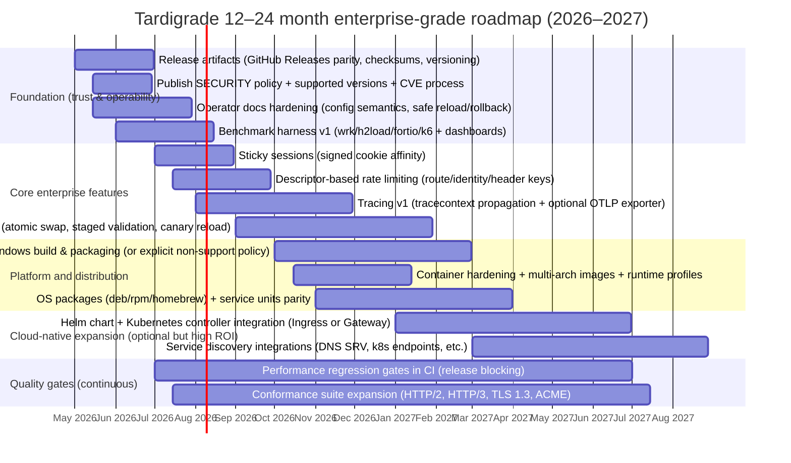

# Tardigrade Deep Research Report

## Executive summary

Tardigrade is an ambitious, security-conscious edge gateway and HTTP server written in Zig, aiming to cover a wide surface area: static serving, reverse proxying with retries/caching/health checks, multiple HTTP versions (HTTP/1.1, HTTP/2, opt-in HTTP/3), protocol “bridges” (FastCGI/SCGI/uWSGI/gRPC/memcached), and even mail relays (SMTP/IMAP/POP3). These claims are explicit in its README and are reinforced by its build script (OpenSSL linking + optional ngtcp2/nghttp3 for HTTP/3) and a large set of protocol/security-related source files. citeturn28view0turn14view1turn4view0turn13view0turn21view1

Compared to mature incumbents—entity["company","NGINX","web server and proxy"], entity["organization","Envoy Proxy","cncf l7 proxy"], entity["organization","HAProxy","tcp/http load balancer"], and entity["company","Traefik","cloud native proxy"]—Tardigrade already demonstrates several “enterprise-shaped” primitives (Prometheus metrics endpoint, structured access logs, active health checks, configuration validation, reload/stop control plane CLI, sane request-size/timeout limits, upstream TLS verification and client cert support, master/worker supervision options, and binary-upgrade toggles). citeturn28view0turn12view0turn35view4turn14view1turn27view0

However, the biggest blockers to “enterprise-grade like NGINX” are not core features but operational maturity and ecosystem: multi-platform packaging (notably Windows), GA-quality release artifacts (GitHub releases are currently empty even though tags exist), hard security posture guarantees (clear vulnerability disclosure/security policy, reproducible builds/SBOM/signing), deep observability (distributed tracing), scalable dynamic configuration/service discovery comparable to Traefik’s provider model or Envoy’s xDS, and a proven performance story backed by public, repeatable benchmarks. citeturn23view0turn24view0turn8view1turn28view0turn32search1turn32search9turn34search9

If you assume no budget/team constraints, the shortest path to “enterprise-like” credibility is a dual track:
1) **Hardening and packaging** (security, releases, CI quality gates, long-term support model, documentation “operator-grade”).
2) **Control-plane maturity** (safe dynamic config, discovery integrations, HA story, upgrade/rollback guarantees), while validating **performance and correctness** with a benchmark+conformance program anchored to standard tools and protocol RFCs (HTTP/2, HTTP/3, QUIC, TLS 1.3, ACME). citeturn39search2turn39search1turn39search0turn39search3turn41search2turn40search1turn40search0turn40search2turn40search3

## Competitive landscape and feature comparison

### Feature-by-feature comparison table

**Legend:** “✅” = clearly supported & documented in cited sources; “⚠️” = partially supported / experimental / depends on edition; “?” = not confirmed from the specific primary sources collected in this review (needs additional verification).

| Category | Tardigrade | entity["company","NGINX","web server and proxy"] | entity["organization","Envoy Proxy","cncf l7 proxy"] | entity["organization","HAProxy","tcp/http load balancer"] | entity["company","Traefik","cloud native proxy"] |
|---|---|---|---|---|---|
| Architecture | Single self-contained Zig runtime positioned as “edge gateway and HTTP server.” citeturn28view0 | High-performance web server/proxy; modular documentation ecosystem. citeturn31search16turn31search7 | L7 proxy + “communication bus”; “out of process architecture,” designed for service-oriented architectures. citeturn32search0turn32search8 | High-performance TCP/HTTP reverse proxy & load balancer; runtime API embedded. citeturn33search12turn41search1 | “Cloud native application proxy,” auto-discovers config via providers; explicit separation of static vs dynamic config. citeturn34search8turn34search9 |
| Proxy modes (reverse proxying, L7/L4) | ✅ HTTP reverse proxy + TCP/UDP upstream proxy envs + mail relay + protocol bridges (FastCGI/SCGI/uWSGI/gRPC/memcached). citeturn28view0turn35view4 | ✅ HTTP reverse proxy + TCP/UDP stream proxy module + mail proxy (product description + stream docs). citeturn31search16turn31search2 | ✅ L7; also supports L4/TCP proxying in real deployments (e.g., Consul describes “all TCP-based protocols” at L4). citeturn32search0turn32search24 | ✅ Explicit TCP and HTTP proxying. citeturn33search12 | ✅ Primarily HTTP application proxy; entrypoints include TCP concept and reference UDP entrypoints in HTTP/3 note (L4 components exist). citeturn41search3turn34search37 |
| Performance / scalability posture | Claims “high-performance” and includes worker/process tuning knobs (threads, queues, master-worker). Needs published perf data. citeturn28view0turn35view4 | Marketed and widely deployed as high-performance server/load balancer; QUIC/HTTP/3 supported since 1.25.0 with documented build constraints. citeturn30search0turn31search3turn31search0 | Marketed as “high performance” with “small memory footprint”; ecosystem includes dedicated perf tooling/org repos (envoy-perf). citeturn32search8turn30search21 | Project positions itself as “very fast and reliable”; supports HTTP/3/QUIC in modern branches/manuals. citeturn33search12turn33search16 | Designed for cloud-native routing; strong ecosystem adoption. Performance depends heavily on provider/config patterns; metrics/tracing are first-class. citeturn34search8turn34search2turn34search10 |
| TLS / SSL support | ✅ TLS termination + SNI; upstream TLS verify and upstream client cert/key; ACME envs + key storage paths; links OpenSSL in build. citeturn28view0turn35view4turn13view0turn41search2 | ✅ HTTPS/TLS is core; HTTP/3 module requires OpenSSL ≥1.1.1 and is documented as experimental. citeturn31search0turn31search3 | ? (Not validated in collected primary sources for this report; Envoy is typically used for TLS/mTLS in practice, but confirm via Envoy TLS docs before making enterprise commitments.) citeturn32search0 | ✅ TLS commonly used; HTTP/2 docs stress ALPN over HTTPS and OpenSSL dependency. citeturn33search11 | ✅ TLS termination + ACME is part of Traefik’s positioning; HTTP/3 requires TLS and uses UDP+TLS. citeturn34search27turn41search3turn41search19 |
| HTTP/2 support | ✅ Explicitly supported. citeturn28view0 | ✅ `ngx_http_v2_module` provides HTTP/2 support. citeturn31search1 | ✅ “First class support for HTTP/2 and gRPC.” citeturn32search8turn32search16 | ✅ Supported (especially client-facing) per HAProxy docs/tutorials. citeturn33search11turn33search17 | ✅ Supported (core positioning + docs ecosystem); not the focus of this row. citeturn34search8turn34search36 |
| HTTP/3 support | ✅ “Opt-in HTTP/3 via ngtcp2/nghttp3;” build option links ngtcp2/nghttp3; includes 0-RTT resumption test client harness. citeturn28view0turn13view0turn21view1 | ⚠️ `ngx_http_v3_module` provides **experimental** HTTP/3 support; QUIC/HTTP/3 supported since 1.25.0 with build flags. citeturn31search0turn31search3 | ? (Not confirmed from collected primary sources here; validate via Envoy QUIC/HTTP/3 docs before positioning as parity.) citeturn32search21turn39search1turn39search0 | ✅ HTTP/3 over QUIC referenced in HAProxy configuration manuals (noting some QUIC limitations like connection migration not supported). citeturn33search16turn33search5 | ✅ Documented `http3` entrypoint setting; notes UDP port behavior and TLS requirement. citeturn41search3turn41search19 |
| Observability (metrics/logs/tracing) | ✅ Built-in `/metrics` Prometheus text + JSON metrics; `/status`; configurable JSON access logs; syslog UDP option; log rotation settings. Tracing: not evidenced as distributed tracing in README. citeturn28view0turn29view2turn35view4 | ✅ Basic status via `ngx_http_stub_status_module` (enabled when built); deeper observability depends on ecosystem/editions. citeturn31search6turn31search16 | ✅ Strong observability posture; OTel tracing sandbox exists; dynamic config is built-in for operations. citeturn32search29turn32search1 | ✅ Prometheus metrics endpoint documented; broad monitoring ecosystem. citeturn33search3turn33search10 | ✅ Metrics support includes OpenTelemetry + Prometheus and others; explicit OTel tracing docs. citeturn34search2turn34search10 |
| Load balancing algorithms | ✅ Enumerated algorithms include `round_robin`, `least_connections`, `ip_hash`, `generic_hash`, `random_two_choices` (and weighted upstreams via env arrays). citeturn26view0turn35view4 | ✅ Documented `ip_hash` for upstreams; full algorithm set depends on modules/config. citeturn26view0 | ✅ Extensive set: weighted RR, least request (P2C), ring hash, Maglev, random, locality-aware options. citeturn32search7turn32search3 | ✅ “No less than 10” algorithms; examples include round-robin, leastconn, source, URI. citeturn33search35 | ✅ Explicit “Service Load Balancer” concept; supports sticky sessions in ecosystem (cookie-based). (Algorithm detail not fully extracted in collected sources.) citeturn34search0turn26view0 |
| Health checks | ✅ “Active upstream health checks” and probe controls documented via envs (`*_PROBE_*`). citeturn28view0turn29view4 | ? (Health-check behavior is well-known in practice; for rigor, confirm in upstream module / commercial docs before parity claims.) citeturn31search7 | ? (Not confirmed in collected sources; typically present in Envoy via health checking APIs—verify in Envoy docs for enterprise claims.) citeturn32search21 | ? (Not confirmed in collected sources; HAProxy commonly supports health checks but validate via manual sections.) citeturn33search0 | ? (Not validated in collected sources for this report; verify service health-check settings.) citeturn34search0 |
| Configuration model (file vs API) | ✅ NGINX-style config files + env vars; operator CLI supports validate/reload/stop. citeturn28view0turn12view0 | ✅ File-based configuration; also a documented HTTP API module exists (exposes reload count/time). citeturn31search7turn41search16 | ✅ YAML/proto-based config with strong dynamic config story (xDS). citeturn32search9turn32search21 | ✅ File-based config (`haproxy.cfg`), plus Runtime API for in-memory changes. citeturn33search13turn41search1 | ✅ Explicit separation: install (static) vs routing (dynamic) configuration methods. citeturn34search9 |
| Dynamic config | ⚠️ Hot reload is documented; config discovery paths and reload command exist; “dynamic discovery” (service discovery/control plane) is not evidenced. citeturn28view0turn12view0turn35view4 | ✅ Reload-based (reload count/time exposed via API module). citeturn41search16 | ✅ Core capability: xDS (gRPC/REST/filesystem watch) and dynamic filesystem updates. citeturn32search9turn32search5turn32search1 | ✅ Runtime API supports some config changes without reload; hitless reload guidance exists. citeturn41search1turn41search13turn41search21 | ✅ Provider-driven dynamic config; multiple ingestion methods. citeturn34search9turn34search1 |
| Clustering / HA | ? (No clustering primitives documented; master-worker is local supervision, not multi-node HA.) citeturn35view4 | ? (Often achieved via external orchestration + shared config management; not established from collected sources.) citeturn31search7 | ✅ Commonly deployed at scale; dynamic control-plane patterns exist (xDS). (Exact HA details depend on control plane.) citeturn32search1turn32search9 | ✅ Supports operational patterns like hitless reload; HA is typically achieved with redundant instances + external failover. citeturn41search13turn41search21 | ✅ Strong cloud-native HA patterns via Kubernetes/provider integration. citeturn34search1turn34search13 |
| Service discovery | ? (No Kubernetes/Consul/etc discovery described in README.) citeturn35view0turn35view1 | ? (Not derived from collected sources.) citeturn31search7 | ✅ Designed around discovery (xDS). citeturn32search1turn32search9 | ? (Not derived from collected sources; HAProxy commonly integrates via DNS or orchestration, but verify.) citeturn33search0 | ✅ Core differentiator: provider/service discovery-based dynamic routing; Kubernetes Ingress support is first-class. citeturn34search8turn34search1 |
| Extensibility (plugins/modules) | Zig codebase shows many built-in capabilities; no documented plugin ABI. citeturn4view0 | Modular design via modules. citeturn31search7 | ✅ Strong extension model via filters; dynamic modules schema exists (dlopen). citeturn32search13 | ✅ Strong configuration DSL; runtime API + ecosystem (enterprise add-ons) but plugin model differs from Envoy. citeturn41search1turn33search17 | ✅ Middlewares + plugin ecosystem; extensive docs around middleware concepts. citeturn34search35turn34search3 |
| Security features (WAF, rate limiting, auth) | ✅ Built-in: basic auth token hashes, per-IP rate limit, security headers, geo blocking, access-control rules, request/header/body limits; plus upstream trust headers and secret-handling paths. WAF: not described as a WAF engine. citeturn29view0turn29view4turn27view0turn35view4 | ✅ Rate limiting via `limit_req_zone`; WAF is typically via add-ons/third party (verify separately). citeturn27view0 | ✅ Descriptor-based local rate limiting (proto documented); broader auth/WAF capabilities require additional Envoy filter documentation review. citeturn27view0turn32search0 | ✅ Stick tables for flexible policy controls; session persistence and other security patterns documented; Runtime API allows operational toggles. citeturn27view0turn26view0turn41search1 | ✅ RateLimit middleware; distributed rate limiting is productized in Traefik Enterprise/Hub; WAF discussed in Traefik ecosystem (often via add-ons/plugins). citeturn34search3turn34search19turn34search11 |
| Deployment patterns (k8s, containers, cloud) | ✅ Repo includes Docker image guidance + GHCR image statement; packaging includes systemd/launchd service files. No Kubernetes-native controller. citeturn35view4turn10view0turn12view0turn9view0 | ✅ Broad packaging/install ecosystem; typical fit for containers and system packages. citeturn30search8turn30search24 | ✅ Common in cloud-native; CNCF ecosystem. citeturn30search5turn32search0 | ✅ Deployed as service/ingress; Kubernetes ingress ecosystems exist. citeturn33search12turn33search32 | ✅ Kubernetes Ingress controller support is first-class; provider model targets orchestrators. citeturn34search1turn34search37 |
| Windows/Linux support | Linux/macOS are explicit in build/release automation; systemd/launchd packaging exists; Windows packaging not shown. citeturn8view1turn10view0turn24view0 | Windows builds exist in the broader ecosystem, but confirm exact support and modules per distribution. citeturn30search8 | Cross-platform usage common; confirm Windows production posture in Envoy docs for your target. citeturn30search5 | Strong on Linux/Unix-like; confirm Windows story from HAProxy docs if needed. citeturn33search12 | Commonly deployed in containers on Linux; Windows status depends on build/distribution paths. citeturn30search7 |
| Licensing | Apache 2.0. citeturn36view0turn35view4 | BSD-2-Clause-like (“simplified 2-clause BSD-like license”). citeturn30search0turn30search4 | Apache 2.0. citeturn30search1turn30search5 | GPLv2 (with nuances described in LICENSE; see official docs). citeturn30search2turn30search6turn30search26 | MIT license. citeturn30search3turn30search7 |
| Community / activity | Very small GitHub footprint (low stars/forks), 3 open issues, 1 tag (v0.32.0), no GitHub releases published yet. citeturn25view0turn24view0turn23view0 | Large, long-lived ecosystem; official repo and docs maintained. citeturn30search0turn30search8 | Large CNCF-hosted project; frequent updates. citeturn30search5turn30search21 | Mature long-lived project with extensive documentation set. citeturn33search12turn30search26 | Very active repo with frequent releases. citeturn30search7turn34search37 |

### Visual grounding of the four incumbents’ architectures

image_group{"layout":"carousel","aspect_ratio":"16:9","query":["NGINX architecture diagram","Envoy proxy architecture diagram xDS","HAProxy architecture diagram","Traefik architecture diagram providers"],"num_per_query":1}

## Repository review of Tardigrade

### Codebase structure and language

Tardigrade is primarily a Zig project: the README requires Zig 0.14.1+, and the build metadata sets `.minimum_zig_version = "0.14.1"`. citeturn28view0turn15view0

The repository includes a large `src/` tree with many HTTP, security, protocol, and gateway-oriented components; the directory listing shows numerous modules such as ACME, auth, basic auth, JWT, rate limiting, health checking, and multiple HTTP protocol handlers, indicating a broad in-process feature approach rather than a thin-core + plugin ABI. citeturn4view0

### Dependencies and build model

The build script links against system `ssl` and `crypto` libraries and conditionally links `ngtcp2`, `ngtcp2_crypto_ossl`, and `nghttp3` when an “enable HTTP/3 ngtcp2/nghttp3” option is turned on. This supports the README’s statement “opt-in HTTP/3 via ngtcp2/nghttp3,” and also implies **system-level dependency management** is a major operational consideration for enterprise distributions. citeturn14view1turn13view0turn28view0

The Zig package manifest shows an (effectively) empty dependency set, suggesting the project relies mainly on Zig stdlib plus system libraries (rather than pulling in many Zig packages). citeturn15view0turn15view2

### CI, tests, and release automation

GitHub Actions CI runs both unit tests and “live-process integration tests” (`zig build test` and `zig build test-integration`). citeturn6view0turn14view1

The repository has a dedicated integration test suite (`tests/integration.zig` plus additional integration-related files), and the build script explicitly wires an integration test step. citeturn16view0turn14view1turn17view0

There are workflows for container publishing and releases. The release workflow builds Linux x86_64 and macOS (x86_64 + arm64) archives and produces SHA-256 checksums, but **GitHub Releases are currently empty**. Meanwhile, tags exist (e.g., `v0.32.0` dated April 15, 2026), suggesting the release pipeline is either new, not fully wired to GitHub Releases, or blocked by permissions. citeturn8view1turn23view0turn24view0turn22view0

### Documentation and operator surface

The README is unusually operator-focused for a small project: it documents config discovery paths, an operator CLI (`run`, `validate`, `reload`, `stop`, config init), and built-in operator endpoints (`/health`, `/status`, `/metrics`, `/status/metrics`). citeturn28view0turn29view2

It documents an extensive environment-variable configuration surface spanning upstream pools, load balancing algorithm selection, probes/health checks, circuit breaker toggles, caching controls, JSON + syslog logging, request limits, compression, and process model knobs like master-worker supervision and binary-upgrade behavior. citeturn29view4turn35view4

### Issues, development signals, and security posture indicators

The repo has 3 open issues, and they are “enterprise-shaped” (sticky sessions, route-aware rate limiting keys, and a production-style routing bug). Notably, issue #19 explicitly lists the load balancing algorithms already supported, and the issue text calls out gaps like cookie-based session affinity. This is valuable as a roadmap signal. citeturn25view0turn26view0

From the GitHub UI, “Security and quality” shows `0` (no surfaced alerts/features visible in the excerpted UI). This is not the same as a formal security program; it mainly indicates GitHub’s dashboard is not currently surfacing security items for this repo. citeturn10view0turn6view0

The project is licensed under Apache 2.0, which is typically enterprise-friendly for distribution and commercial support models. citeturn36view0turn35view4

## Enterprise gaps and prioritized recommendations

### What “enterprise-grade like NGINX” implies in practice

For an enterprise buyer/operator, “like NGINX” usually means: stable and predictable config semantics, safe reload/upgrade behavior, high throughput/low latency, clear observability, hardened defaults, broad packaging footprint, documented security posture, and a credible support and release lifecycle. The incumbents demonstrate pieces of this in their docs (e.g., NGINX’s HTTP/2 and experimental HTTP/3 modules and status module, Envoy’s xDS dynamic config and OTel sandbox, HAProxy’s runtime API and QUIC/HTTP/3 documentation, Traefik’s provider-based dynamic config and OTel support). citeturn31search1turn31search0turn31search6turn32search1turn32search5turn32search29turn41search1turn33search16turn34search9turn34search10

### Prioritized improvement backlog for Tardigrade

The table below focuses on the highest leverage moves to close the enterprise gap. Effort is relative to Tardigrade’s current maturity and assumes a capable team.

| Priority area | Gap vs enterprise expectations | Concrete implementation suggestions | Effort |
|---|---|---|---|
| Release engineering and artifact credibility | Tags exist but **no GitHub Release artifacts** are published; enterprise adopters expect signed artifacts, reproducible release notes, and a stable channel strategy. citeturn23view0turn24view0turn8view1 | Make GitHub Releases a required output of the release workflow (verify permissions & triggers). Treat “release presence” as a CI gate. Align README claims with reality (or fix the pipeline so the claim becomes true). citeturn28view0turn8view1turn23view0 | Medium |
| Security program and disclosure | No explicit enterprise-grade security posture is evidenced (e.g., SECURITY.md, triage SLA, CVE workflow). The GitHub “security and quality” UI does not substitute for this. citeturn10view0turn6view0 | Publish **SECURITY.md** (policy + reporting), define supported versions, and document security headers/limits and threat model as first-class docs. Tie release cadence to vulnerability response. | Medium |
| Dynamic configuration and control plane | Tardigrade supports hot reload and rich config but lacks the **discovery/control-plane** story that makes Envoy and Traefik “enterprise-scale.” citeturn28view0turn32search1turn32search9turn34search9 | Introduce a scoped “enterprise control plane” layer: start with **atomic file-replace reload** semantics (like Envoy’s documented file update requirement) + validation sandboxing. Then add optional dynamic config endpoints (gRPC/REST) with strict authz and staged rollout. citeturn32search5turn28view0 | High |
| Observability depth (distributed tracing) | Metrics and logs exist; distributed tracing is not evidenced. Modern enterprise ingress/gateways often require correlation across services (OTel). citeturn28view0turn34search10turn32search29 | Implement trace-context propagation (W3C tracecontext) and an optional OTLP exporter pipeline for spans, mirroring what Traefik documents and Envoy demonstrates in sandboxes. Start with request/response spans + upstream spans; add sampling config. citeturn34search10turn32search29 | High |
| Load balancing “enterprise knobs” | Missing cookie-based stickiness and route-aware rate limiting keys are already tracked issues; these are baseline enterprise needs for multi-tenant APIs. citeturn26view0turn27view0 | Implement signed-cookie affinity (HMAC) as suggested in issue #19; implement descriptor-based rate limits (key sources: header/auth identity/route label) per issue #20; expose per-zone metrics and safe hashing of secrets. citeturn26view0turn27view0turn27view1 | Medium |
| Multi-platform packaging | Current packaging targets systemd and launchd; CI release builds are Linux/macOS only; Windows packaging/support is not present. citeturn10view0turn12view0turn8view1 | Expand CI build matrix to Windows, publish MSI/zip, and document supported TLS library strategy on Windows. If Windows is deferred, explicitly declare it “unsupported” to avoid enterprise ambiguity. citeturn8view1turn13view0 | Medium–High |
| Performance & correctness narrative | No public benchmark suite is referenced; enterprise adoption requires repeatable proofs for HTTP/1.1+HTTP/2+HTTP/3, TLS, caching, and reload safety. citeturn28view0turn40search0turn40search1turn33search16turn31search0 | Create a “perf & conformance” repo folder with scripted runs for `wrk`, `h2load`, `fortio`, `k6`. Publish baseline numbers and regression thresholds; treat regressions as release blockers. citeturn40search0turn40search1turn40search2turn40search3 | Medium |
| Kubernetes-native story | No Kubernetes Ingress/Gateway API controller exists; competing ingress/controllers win here. citeturn35view0turn34search1turn34search13 | If enterprise targets Kubernetes: ship Helm chart + controller integration (Ingress + Gateway API). If not: position Tardigrade like “NGINX as a binary” and focus on packaging + enterprise OS footprints. citeturn34search1turn34search13 | High |

## Roadmap milestones and a 12–24 month plan

The timeline below assumes “today” is April 2026 and targets a credible enterprise posture by mid–late 2027, aligning work into milestone releases. It is intentionally biased toward building trust (security + releases + benchmarks) first, because those unlock adoption even before every feature reaches parity.



## Benchmarking methodology and baseline targets

### Methodology: what “good” looks like for an edge proxy

A proxy benchmark program should isolate at least four planes:

1) **Data plane performance:** throughput (RPS/QPS), tail latency (p95/p99/p99.9), concurrency behavior, connection reuse, and CPU/memory per request.
2) **Protocol correctness and compliance:** HTTP/2 (RFC 9113), HTTP/3 over QUIC (RFC 9114 + RFC 9000), and TLS 1.3 behavior (RFC 8446). citeturn39search2turn39search1turn39search0turn39search3  
3) **Operational behavior under change:** hot reload safety, graceful drain, error budgets, and backpressure behavior during rollout.
4) **Security and abuse resistance:** slowloris-style header/body timeouts, oversized headers, request smuggling attempts, rate limiting correctness (global vs keyed), auth overhead, and “fail closed” behavior under dependency failures.

Tardigrade already exposes many of the control knobs needed to test these (timeouts, max header size/count, max body size, keep-alive constraints, per-IP connection caps, rate limits, cache TTL, upstream retries/timeouts). citeturn35view4turn29view0turn29view4

### Recommended tools

Use a small set of standard tools and keep results reproducible:

- `wrk` for high-throughput HTTP/1.1 benchmarking on a single generator node. citeturn40search0  
- `h2load` for HTTP/2 **and HTTP/3** load generation (this matters because many HTTP/3 test harnesses are scarce). citeturn40search1  
- `fortio` for microservice-style load tests; it explicitly targets HTTP and gRPC load testing and provides histogram outputs and a UI/API mode. citeturn40search2turn40search6  
- `k6` for scenario-based tests (spike/soak, multi-step workflows, thresholds as pass/fail gates). citeturn40search3turn40search7  

### Sample benchmark scenarios and what to measure

**Static file serving**
- Scenario: 1 KB, 32 KB, 1 MB static assets; keep-alive enabled; TLS on/off.
- Metrics: RPS, p99 latency, memory growth under concurrency, CPU utilization, bytes/sec.

**Reverse proxy baseline**
- Scenario: proxy to a local upstream with minimal work; test retries off/on; upstream timeouts; circuit breaker threshold toggles.
- Metrics: added latency vs direct upstream, upstream connection reuse, error rate under upstream failure, retry amplification.

**HTTP/2 multiplexing**
- Scenario: many small requests on few connections; compare p99 vs HTTP/1.1.
- Metrics: stream concurrency handling, head-of-line avoidance at HTTP layer, memory per active conn.

**HTTP/3 / QUIC**
- Scenario: `h2load` HTTP/3 at increasing concurrency; test 0-RTT resumption when enabled (Tardigrade includes a resumption test client harness around `osslclient` and looks for `type=0RTT` markers). citeturn21view1turn13view0turn31search0turn39search1turn39search0  
- Metrics: handshake latency vs HTTP/2+TLS, p99 response latency under packet loss, stability (timeouts, retries), CPU per request.

**Reload and config safety**
- Scenario: reload config every N seconds under steady load; verify no spike in 5xx; verify connections drain.
- Metrics: request failure rate during reload, tail latency spikes, time-to-apply config.

### Expected baseline targets (initial, then tighten quarterly)

Because no public baseline exists yet for Tardigrade, the right enterprise approach is to set *initial* targets as “non-regression” and ratchet up:
- HTTP/1.1 reverse proxy: maintain p99 latency within a small fixed budget over upstream (e.g., ≤1–3 ms at low latency, or ≤5–10% overhead at moderate latency) under representative concurrency.
- HTTP/2: show improved throughput and/or reduced connection count without tail-latency regressions vs HTTP/1.1 at equal request volume (aligned with HTTP/2’s multiplexing rationale). citeturn39search2  
- HTTP/3: demonstrate functional correctness and stable latency under moderate loss conditions; treat “experimental” as acceptable early but explicitly label it (as NGINX does for its HTTP/3 module). citeturn31search0turn39search1turn39search0  
- Observability overhead: keep metrics/logging enabled by default without materially impacting p99 latency; prove with A/B runs.

## Enterprise packaging, deployment patterns, and commercial support models

### Distribution and packaging recommendations

Tardigrade already documents:
- a Docker image workflow and GHCR image pull commands, and notes the CI image runs as non-root with a `/health` container healthcheck, citeturn35view4turn9view0  
- host-native service manifests under `packaging/` for systemd and launchd, citeturn10view0turn12view0  
- and a release workflow that builds Linux+macOS binaries with checksums. citeturn8view1  

To become “enterprise-grade,” turn these into a formal distribution matrix:
- **Containers:** multi-arch images (amd64/arm64), minimal base, non-root, strict default seccomp/apparmor profiles, and a compatibility policy for OpenSSL vs system libraries (especially because HTTP/3 depends on ngtcp2/nghttp3 integration). citeturn13view0turn35view4  
- **Native packages:** DEB/RPM packages that install config templates, service units, logrotate config, and a default non-root user, matching the systemd manifest patterns already in repo (and clearly describing privileged-port guidance like `CAP_NET_BIND_SERVICE`). citeturn12view0turn35view4  
- **macOS:** Homebrew tap + launchd plist, leveraging what exists in `packaging/launchd/`. citeturn10view0turn11view1  
- **Windows:** either (a) add Windows CI builds and ship a signed MSI/zip + Windows service integration, or (b) explicitly state “not supported” for enterprise to avoid ambiguous risk. Current release builds do not include Windows. citeturn8view1turn24view0  

### Deployment patterns to support

Given Tardigrade’s current personality (NGINX-like config, lots of built-in features), three enterprise deployment archetypes make sense:

1) **Standalone edge / DMZ reverse proxy**
   - Deploy as a hardened binary on Linux VMs/bare metal with systemd.
   - Use the existing operator endpoints (`/health`, `/metrics`) for monitoring and attach centralized logging.
   - This aligns closely with NGINX-style operations. citeturn29view2turn12view0turn31search16

2) **Containerized edge gateway**
   - Run the GHCR image behind a cloud load balancer; expose `/health` to liveness/readiness checks.
   - Use config injection via mounted config + secrets paths (already part of Tardigrade’s config model). citeturn35view4turn29view4

3) **Kubernetes ingress/controller (optional “big bet”)**
   - Compete directly with Traefik-style and Envoy-based ingress by shipping a controller/Helm chart.
   - This is the largest engineering investment but unlocks enterprise Kubernetes adoption patterns where competitors are strongest. citeturn34search1turn34search13turn32search1

### Commercial support and enterprise business models

Your licensing choice (Apache 2.0) supports several credible enterprise models without forcing an open-core trap. citeturn36view0

A pragmatic enterprise approach (mirroring what incumbents do in different ways) is:

- **Open source core + paid support**: Sell SLA-backed support, security patch backports, and architecture reviews. NGINX highlights enterprise distributions/support availability (via F5). citeturn30search8turn30search0  
- **Enterprise distribution channel**: Provide a “Tardigrade Enterprise” repo with hardened builds, longer support windows, and compliance artifacts (even if code remains Apache-2.0).  
- **Managed control plane add-on**: If you build a dynamic config/discovery layer, you can monetize the control plane (similar to how Traefik productizes cluster-wide features like distributed rate limiting). citeturn34search19turn34search23  
- **Training & certification**: Operators value “known-good” playbooks; Traefik and Envoy ecosystems heavily emphasize operational documentation and community training resources. citeturn34search8turn30search17  

## Primary sources and standards links

Key repositories and official docs referenced throughout (grouped for convenience):

```text
Tardigrade (Bare-Systems)
- https://github.com/Bare-Systems/Tardigrade
- https://github.com/Bare-Systems/Tardigrade/blob/main/README.md
- https://github.com/Bare-Systems/Tardigrade/blob/main/build.zig
- https://github.com/Bare-Systems/Tardigrade/blob/main/CHANGELOG.md
- https://github.com/Bare-Systems/Tardigrade/tags
- https://github.com/Bare-Systems/Tardigrade/releases
- https://github.com/Bare-Systems/Tardigrade/issues

NGINX
- https://nginx.org/en/docs/
- https://nginx.org/en/docs/http/ngx_http_v2_module.html
- https://nginx.org/en/docs/http/ngx_http_v3_module.html
- https://nginx.org/en/docs/quic.html
- https://nginx.org/en/docs/stream/ngx_stream_proxy_module.html
- https://nginx.org/en/docs/http/ngx_http_stub_status_module.html
- https://github.com/nginx/nginx

Envoy
- https://www.envoyproxy.io/docs/envoy/latest/intro/what_is_envoy
- https://www.envoyproxy.io/docs/envoy/latest/intro/arch_overview/operations/dynamic_configuration
- https://www.envoyproxy.io/docs/envoy/latest/api-docs/xds_protocol
- https://www.envoyproxy.io/docs/envoy/latest/start/sandboxes/opentelemetry
- https://www.envoyproxy.io/docs/envoy/latest/intro/arch_overview/upstream/load_balancing/load_balancers
- https://github.com/envoyproxy/envoy

HAProxy
- https://www.haproxy.org/
- https://docs.haproxy.org/3.2/configuration.html
- https://www.haproxy.com/documentation/haproxy-runtime-api/
- https://www.haproxy.com/documentation/haproxy-configuration-tutorials/alerts-and-monitoring/prometheus/

Traefik
- https://doc.traefik.io/traefik/
- https://doc.traefik.io/traefik/reference/routing-configuration/dynamic-configuration-methods/
- https://doc.traefik.io/traefik/providers/kubernetes-ingress/
- https://doc.traefik.io/traefik/observability/metrics/overview/
- https://doc.traefik.io/traefik/v3.0/observability/tracing/opentelemetry/
- https://doc.traefik.io/traefik/routing/entrypoints/
- https://github.com/traefik/traefik

Protocol RFCs
- QUIC (RFC 9000): https://www.rfc-editor.org/rfc/rfc9000.html
- HTTP/3 (RFC 9114): https://www.rfc-editor.org/rfc/rfc9114.html
- HTTP/2 (RFC 9113): https://www.rfc-editor.org/rfc/rfc9113.html
- TLS 1.3 (RFC 8446): https://www.rfc-editor.org/rfc/rfc8446.html
- ACME (RFC 8555): https://www.rfc-editor.org/rfc/rfc8555.html

Benchmarking tools
- wrk: https://github.com/wg/wrk
- h2load / nghttp2 (HTTP/1.1 + HTTP/2 + HTTP/3 benchmarking): https://github.com/nghttp2/nghttp2
- Fortio: https://github.com/fortio/fortio
- k6: https://github.com/grafana/k6
```