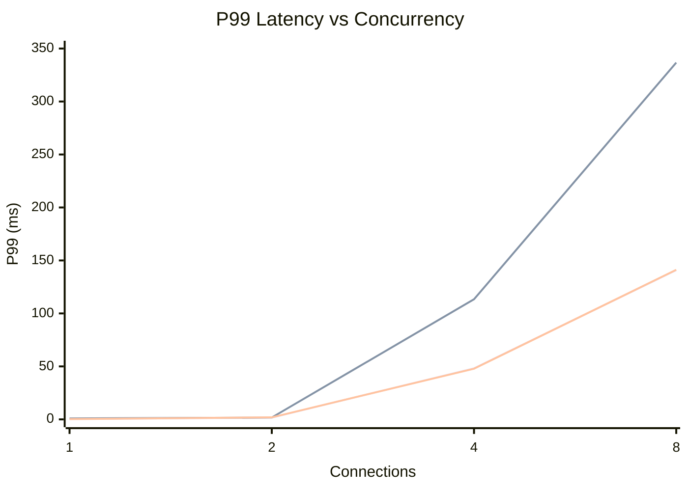
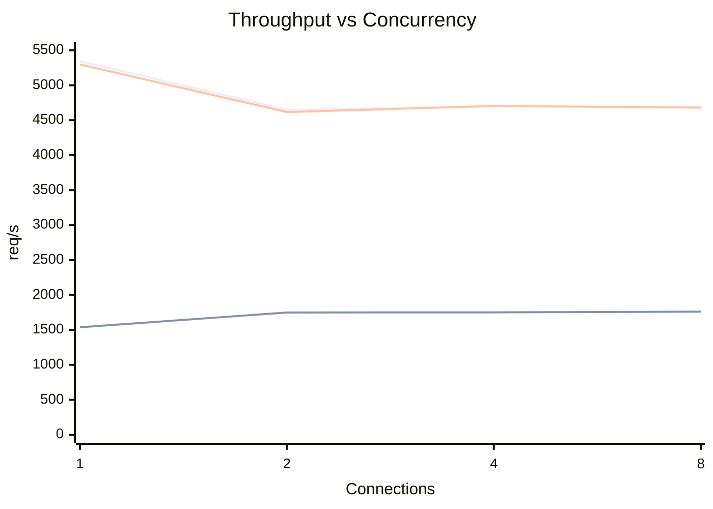

# Loopback Concurrency Sweep

Date: `2026-05-10`

Target:
- Benchmark host: `dedicated benchmark target`
- Guest: `dedicated benchmark target`
- Driver: `wrk` running **inside** the guest
- URL base: `http://127.0.0.1:8069`
- Duration: `30s` per scenario

Method:
- `static-http1`: `GET /health`
- `proxy-http1`: `GET /proxy/health`
- `keepalive`: `GET /health`
- Threads: `min(2, concurrency)`
- Concurrency sweep: `1`, `2`, `4`, `8`

## Results

| Concurrency | Threads | Scenario | req/s | p50 (ms) | p99 (ms) | Socket read errors | Socket timeouts |
| ---: | ---: | --- | ---: | ---: | ---: | ---: | ---: |
| 1 | 1 | `static-http1` | 5344.30 | 0.182 | 0.261 | 1608 | 0 |
| 1 | 1 | `proxy-http1` | 1537.73 | 0.639 | 0.847 | 462 | 0 |
| 1 | 1 | `keepalive` | 5298.18 | 0.183 | 0.271 | 1594 | 0 |
| 2 | 2 | `static-http1` | 4647.52 | 0.416 | 1.570 | 1397 | 0 |
| 2 | 2 | `proxy-http1` | 1749.30 | 1.130 | 1.740 | 524 | 0 |
| 2 | 2 | `keepalive` | 4616.01 | 0.419 | 1.870 | 1384 | 0 |
| 4 | 2 | `static-http1` | 4700.36 | 0.497 | 48.250 | 1409 | 0 |
| 4 | 2 | `proxy-http1` | 1750.78 | 1.300 | 113.350 | 524 | 0 |
| 4 | 2 | `keepalive` | 4702.74 | 0.497 | 47.860 | 1410 | 0 |
| 8 | 2 | `static-http1` | 4687.67 | 0.559 | 140.730 | 1406 | 0 |
| 8 | 2 | `proxy-http1` | 1761.56 | 1.410 | 336.690 | 528 | 0 |
| 8 | 2 | `keepalive` | 4679.79 | 0.563 | 141.200 | 1403 | 0 |

## Charts

## Takeaways

- The guest has `2` workers, and the best latency behavior appears at or below that worker count.
- `proxy-http1` improves in throughput from `c=1` to `c=2`, then stays effectively flat from `c=2` to `c=8`.
- `static-http1` and `keepalive` throughput are already near peak at `c=1`; increasing concurrency does not materially improve throughput.
- The large p99 values at `c=4` and `c=8` are queueing effects, not evidence of a slow hot path:
  - `proxy-http1` p50 stays around `0.639–1.410 ms`
  - `proxy-http1` p99 jumps from `1.740 ms` at `c=2` to `113.350 ms` at `c=4` and `336.690 ms` at `c=8`
- For canonical latency reporting on this `2`-worker perf guest, `c=2` is the most representative benchmark point.
