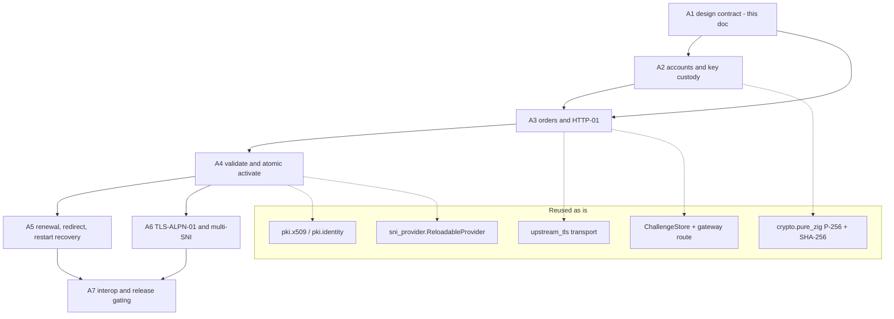
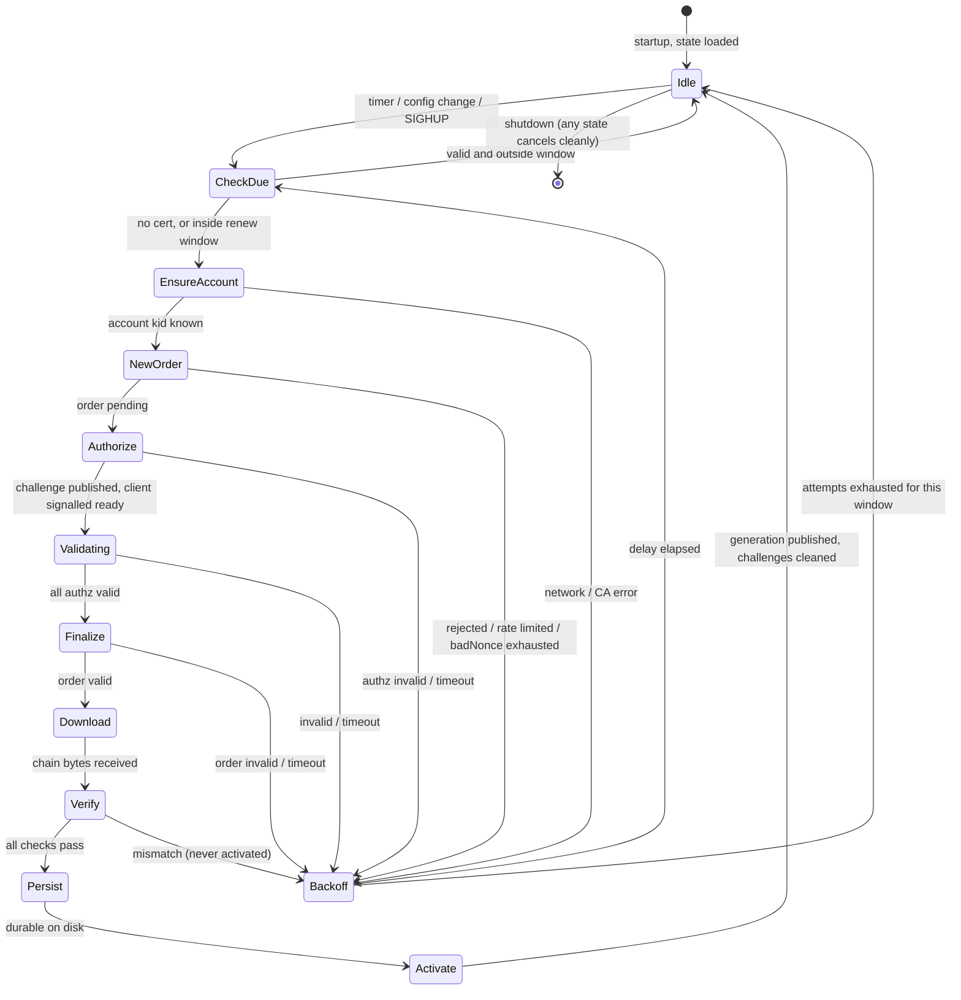
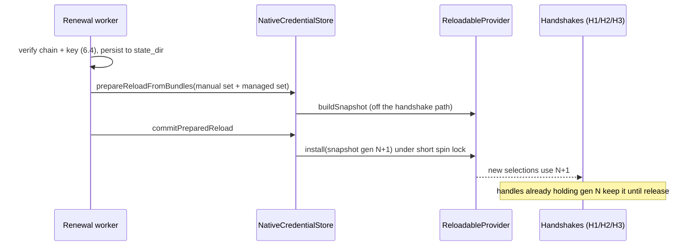

# Native automatic HTTPS (ACME) — architecture and implementation contract (#831)

Phase **A1** of epic #759 (under #773). This is a **design document**. It
specifies how Tardigrade will obtain and renew certificates with ACME
(RFC 8555) on the native, pure-Zig TLS stack. It implements nothing.

> **Status: not supported.** `TARDIGRADE_TLS_ACME_ENABLED=true` is still
> rejected at config validation in every profile
> (`validateNativeTlsBuildConfig`, `src/edge_config.zig`), and
> `acme_client.runOnce()` still fails closed. Nothing in this document is a
> support claim. Support is advertised only when A7 (interop and release
> gating) lands and `docs/SUPPORT_MATRIX.md` is updated by that PR.

Contents: [1 History](#1-history-and-reuse-rule) ·
[2 Audit](#2-audit-of-current-code) ·
[3 Requirement map](#3-requirement-map-759) ·
[4 Operator config](#4-operator-configuration) ·
[5 State machine](#5-issuance-and-renewal-state-machine) ·
[6 Trust boundary](#6-secret-and-trust-boundary) ·
[7 Credential generations](#7-credential-generation-integration) ·
[8 Challenge routing](#8-challenge-routing-and-redirects) ·
[9 Limits and observability](#9-resource-limits-persistence-and-observability) ·
[10 Work split A2–A7](#10-work-split-a2a7) ·
[11 Test plan](#11-test-plan) ·
[12 Open questions](#12-open-questions)

## 1. History and reuse rule

PR #18 (merge `006d490c`, 2026-03-28, issue #16) shipped an OpenSSL-backed
ACME client: ES256 JWS, HTTP-01, CSR generation, atomic cert writes, and a
renewal trigger in the TLS maintenance loop. PR #654 / #649 (merge
`5e8877c2`, 2026-08-24) deleted it with the OpenSSL production backend. The
pure-Zig `ChallengeStore` survived.

Rule: **port the behavior, not the ownership.** The #18 code is a reference
for protocol semantics only. The table below records what to keep and what
the old design got wrong for the native stack.

| #18 behavior | Verdict | Native replacement |
| --- | --- | --- |
| Directory → `newNonce` → `newAccount` → `newOrder` → authz → challenge → finalize → download flow | **Keep** the sequence | State machine, §5 |
| ES256 JWS with `jwk` (new account) then `kid` (everything else) | **Keep** | `SoftwareEcdsaP256SigningKey` (`src/crypto/pure_zig.zig`) |
| Fresh nonce fetch before nearly every request; single JWS context mutated in place | **Replace** — nonce is per-request state with a `badNonce` retry, not a hand-threaded variable | §5.3 |
| `std.time.sleep(2s)` fixed polling inside one blocking `runOnce` | **Replace** — bounded, jittered, `Retry-After`-aware, cancellable | §5.4 |
| `std.http.Client` for CA traffic | **Replace** — outbound HTTPS goes through the native client transport | §2, gap G1 |
| `EC_KEY`/`X509_REQ` for keys and CSR | **Replace** — no OpenSSL types; pure-Zig key owner plus a DER CSR writer | gap G3, G4 |
| Cert/key written to `cert_dir`, then loaded into `TlsTerminator` (`SSL_CTX` swap) | **Replace** — validated bytes publish a new credential **generation**; files are durability only | §7 |
| Renewal trigger inside the TLS maintenance loop that also owned OCSP refresh | **Replace** — dedicated renewal worker with its own lifecycle | §5.5 |
| Operator config: directory URL, domains, email, account key path, cert dir, renew window | **Keep** the lineage, tighten validation | §4 |
| Challenge store shared with the gateway | **Keep**, add bounds and host scoping | §8, gap G5 |

## 2. Audit of current code

Classification: **Reusable** (use as is), **Stub** (surface exists, behavior
does not), **Missing** (nothing in tree).

| Area | Location | Class | Notes |
| --- | --- | --- | --- |
| ACME client surface | `src/http/acme_client.zig` | **Stub** | `AcmeOptions`, `AcmeError`, `daysUntilExpiry` (returns `null`), `runOnce` (returns `error.AcmeProtocolError`). Imported by `src/http.zig`. The option shape is a starting point, not a contract; §10 replaces it. |
| HTTP-01 token store | `src/http/acme_challenge_store.zig` | **Reusable, needs bounds** | Mutex-guarded `StringHashMap`; `put/getCopy/remove`. No entry cap, no TTL, no host scoping, no value-length cap (G5). |
| Challenge route | `src/edge_gateway.zig` (`/.well-known/acme-challenge/`, after TRACE rejection) | **Reusable, needs precedence rules** | Serves `application/octet-stream`, returns TOO_EARLY for replay-exposed early data, records access log/metrics. Falls through to normal routing on a miss. Store is only constructed when `tls_acme_enabled and domains.len > 0` (`src/edge_gateway.zig:118`). |
| Config fields | `src/edge_config.zig` (`tls_acme_*`) | **Reusable** | `TARDIGRADE_TLS_ACME_{ENABLED,CERT_DIR,DIRECTORY_URL,DOMAINS,EMAIL,ACCOUNT_KEY_PATH,RENEW_DAYS_BEFORE_EXPIRY}`. No staging flag, no CA-trust field, no per-host constraints, no state-dir semantics beyond `validateOptionalDir`. |
| Validation gate | `validateNativeTlsBuildConfig` | **Reusable** | Rejects ACME *before* the TLS-files early return so ACME cannot become silently inert. Must keep that ordering (§4.5). |
| Downstream identity loading | `src/tls/identity_loader.zig`, `NativeCredentialStore` in `src/http/native_tls_connection.zig` | **Reusable** | File-path based: `prepareReloadFromFiles(default cert/key, sni specs)` → `commitPreparedReload`. Builds one `Snapshot` from a fixed bundle set. No bundle-from-bytes entry point (G2). |
| Generation provider | `sni_provider.ReloadableProvider` / `Snapshot` (`src/tls/sni_provider.zig`) | **Reusable — authoritative** | Immutable snapshots, monotonically increasing `generation`, atomic `install`, refcounted handles so in-flight handshakes keep their snapshot, `StaleSnapshotGeneration` rejection. Limits: 64 bundles, 16 patterns/bundle, 253-byte host patterns. |
| SNI selection policy | `UnknownSniPolicy.use_default_when_identity_matches` | **Reusable** | Exact and wildcard patterns win; default identity serves an unmapped SNI only if its SAN covers it (RFC 9525, `pki.identity`). |
| H1/H2/H3 sharing | `src/edge_gateway.zig` | **Reusable** | One `NativeCredentialStore` provider is handed to both `native_tls_provider` (TCP; H1 and H2 via ALPN) and `h3_credential_provider` (QUIC). One publish serves all three. |
| Hot reload | `src/gateway_shutdown.zig` (`prepareReloadFromFiles` → commit) | **Reusable pattern** | Prepare-then-publish; a failed prepare rejects the reload and leaves the serving generation. TLS topology (enable/disable) is startup-fixed and rejected on reload. |
| Appliance credentials | `src/tls/appliance_credentials.zig` | **Reusable pattern, not extended** | Strict single Ed25519 identity published through the same `ReloadableProvider`. Appliance ACME stays fail-closed (§4.6). |
| Outbound TLS client | `src/http/upstream_tls.zig` (`UpstreamTlsConn`) | **Reusable transport, missing HTTP layer** | Full verification via `webpki_verifier`; `ca_bundle_path` empty → system bundle candidates → `NoSystemTrustAnchors`. It is a raw connection owned by the proxy path. No bounded HTTP/1.1 request/response client with JSON bodies (G1). |
| X.509 parsing, validity, SAN, SPKI | `src/pki/x509.zig`, `time.zig`, `identity.zig` | **Reusable** | Gives expiry (`Validity`), SAN match (`verifyHost`), SPKI for key/cert binding. |
| P-256 ECDSA signing, SHA-256, OS entropy | `src/crypto/pure_zig.zig`, `std.crypto` | **Reusable** | `SoftwareEcdsaP256SigningKey.fromSeed/fromScalarBytes`, SHA-256 for JWK thumbprint and key authorization. |
| Key generation for a persistent P-256 key | — | **Missing** | Only ephemeral key-share generation exists (G3). |
| DER encoder / CSR writer | `src/pki/der.zig` is a parser | **Missing** | G4. |
| PKCS#8/SEC1 PEM writer, atomic secret-file writer | — | **Missing** | G6. |
| JSON, base64url, JWS framing | `std.json`, `std.base64.url_safe_no_pad` | **Reusable** | Must be bounded (§9). |
| Renewal scheduling, background worker | — | **Missing** | G7. |
| HTTP→HTTPS redirect | — | **Missing** | Only generic `internal_redirect_rules` exist. G8. |

### Gaps

| ID | Gap | Owner |
| --- | --- | --- |
| G1 | Bounded HTTPS request/response client for CA traffic (HEAD, POST, GET; status, `Replay-Nonce`, `Location`, `Retry-After`, `Link`; capped bodies; deadlines) built on `UpstreamTlsConn` | A3 |
| G2 | Publish a bundle set from in-memory DER chains and signer owners (not paths) into the live provider, preserving unrelated bundles | A4 |
| G3 | Persistent P-256 key generation (account and leaf) from OS entropy with scalar validation, wiped buffers, `crypto.secrets` ownership | A2 |
| G4 | DER writer sufficient for a PKCS#10 CSR (subject, SAN extension request, ECDSA-SHA256 signature) | A3 |
| G5 | Challenge store bounds: entry cap, value cap, TTL, host binding | A3 |
| G6 | PKCS#8 PEM writer and atomic `0600` file writer (temp → fsync → rename → fsync dir) | A2 |
| G7 | Renewal worker: scheduler, jitter, backoff, cancellation | A5 |
| G8 | Optional HTTP→HTTPS redirect with challenge exemption | A5 |

## 3. Requirement map (#759)

#759's requirements, mapped to current code and the phase that closes them.

| Requirement | Existing | Closed by |
| --- | --- | --- |
| Opt-in, managed hostnames, directory URL incl. staging | config fields exist; gate rejects them | §4, A2 |
| Account creation and persistence | none | A2 |
| Order, HTTP-01, finalize, download | challenge store and route only | A3 |
| Certificate/key/domain verification before activation | `pki.x509`, `pki.identity`, appliance key-binding precedent | A4 |
| Atomic activation with uninterrupted connections | `ReloadableProvider` | A4 (G2) |
| Renewal with backoff and restart recovery | none | A5 |
| TLS-ALPN-01 and multi-SNI | SNI provider; `acme-tls/1` is only an ALPN no-overlap interop probe today | A6 |
| No foreign TLS/crypto in production | `docs/TLS_DEPENDENCY_POLICY.md` mechanical gate | all; A7 re-verifies |
| Deterministic CI without a real CA | none | §11, A7 |
| Observability without secret leakage | metrics/log infrastructure | §9, A2–A5 |
| Appliance profile stays fail-closed | validation gate | §4.6 |

### Dependency graph



## 4. Operator configuration

### 4.1 Grammar

All settings keep the `TARDIGRADE_TLS_ACME_*` lineage. The opt-in gets a
clearer name and the old one remains an alias, so existing documentation and
muscle memory keep working.

| Env | Directive | Type | Default | Meaning |
| --- | --- | --- | --- | --- |
| `TARDIGRADE_TLS_AUTOMATIC_HTTPS` (alias `TARDIGRADE_TLS_ACME_ENABLED`) | `automatic_https` | bool | `false` | Master opt-in. Everything below is inert and rejected-if-set-without-it. |
| `TARDIGRADE_TLS_ACME_DOMAINS` | `acme_domains` | CSV | `[]` | Managed hostnames. Required non-empty when enabled. |
| `TARDIGRADE_TLS_ACME_DIRECTORY_URL` | `acme_directory_url` | URL | Let's Encrypt **production** | `https://` only (§4.3). Staging and test CAs are ordinary URLs. |
| `TARDIGRADE_TLS_ACME_AGREE_TOS` | `acme_agree_tos` | bool | `false` | Operator accepts the CA's terms of service. Required `true` when enabled (§12 Q1). |
| `TARDIGRADE_TLS_ACME_EMAIL` | `acme_email` | email | `""` | Account contact. Optional; sent as `mailto:`. |
| `TARDIGRADE_TLS_ACME_STATE_DIR` | `acme_state_dir` | path | required | Durable state root (§4.4). Replaces `..._CERT_DIR`, which remains an alias. |
| `TARDIGRADE_TLS_ACME_ACCOUNT_KEY_PATH` | `acme_account_key_path` | path | `<state_dir>/account.key` | Override only for operators who pre-provision a key. |
| `TARDIGRADE_TLS_ACME_CA_BUNDLE_PATH` | `acme_ca_bundle_path` | path | `""` | Trust anchors used to verify the **ACME directory server**. Empty uses the system bundle. Required for private/test CAs. Never affects downstream client verification. |
| `TARDIGRADE_TLS_ACME_RENEW_DAYS_BEFORE_EXPIRY` | `acme_renew_days_before_expiry` | u32 | `30` | Renewal window; `1..=60`, and must be less than the certificate lifetime (§5.5). |
| `TARDIGRADE_TLS_ACME_CHALLENGES` | `acme_challenges` | enum CSV | `http-01` | `http-01`; `tls-alpn-01` is accepted only after A6. |
| `TARDIGRADE_TLS_ACME_EAB_KID` / `_EAB_HMAC_KEY_PATH` | `acme_eab_*` | | unset | External account binding. **Out of scope for A2–A7**; reserved so the grammar does not change later. Set → config error until implemented. |
| `TARDIGRADE_TLS_HTTP_REDIRECT` | `https_redirect` | bool | `false` | Optional HTTP→HTTPS redirect (§8.3). Only valid with `automatic_https`. |

The default directory URL is production on purpose: it matches the existing
documented default. Safety comes from opt-in plus the validation below, not
from a surprising default.

### 4.2 Hostname rules

A managed hostname must be a DNS name, lowercased, no trailing dot, 1–253
bytes, labels 1–63 bytes, validated by `tls/dns_name.zig` (the validator the
SNI provider already uses). Additionally:

- **No IP literals.** No `localhost`, `.local`, `.internal`, `.test`,
  `.invalid` names against a public CA; those are accepted only when the
  directory URL is non-default **and** `acme_ca_bundle_path` is set (a test
  CA).
- **No wildcards.** Wildcards require DNS-01, which is out of scope.
  `*.example.com` is a config error with a message that says why.
- At most **100** managed hostnames (CA SAN limit), and a hard cap of 64
  bundles matches `sni_provider.max_bundles`.
- Duplicates (after lowercasing) are a config error, not silently merged.

Per-host constraints: each managed hostname is covered by exactly one
**order group**. By default all hostnames share one certificate (one SAN
list). `acme_domains` may use `;` to separate groups, e.g.
`a.example.com,www.a.example.com;b.example.com`, which issues one
certificate per group. A group is the unit of order, renewal, and failure
isolation: one failing group never blocks another.

### 4.3 Directory URL

Must be `https://`, a host, no userinfo, no fragment, ≤ 2048 bytes. Plain
`http://` is rejected even for local test CAs; the deterministic local CA
(§11) serves HTTPS with its own trust anchor passed via
`acme_ca_bundle_path`.

### 4.4 State directory

```
<state_dir>/                 mode 0700, owned by the runtime user
  account.key                0600, PKCS#8 PEM, P-256
  account.json               0600, {directory, kid, created_at, contact_hash}
  groups/<group-id>/
    leaf.key                 0600, PKCS#8 PEM, P-256 (current)
    chain.pem                0644-or-stricter, leaf-first, validated
    meta.json                0600, {not_before, not_after, generation_hint, names}
    pending/                 in-flight order only; removed on completion
```

`group-id` is a lowercase hex SHA-256 of the sorted name list truncated to 16
bytes, so renaming the config does not collide with other groups.
`account.json` records the directory URL; a state dir reused with a
different directory URL is a startup error, so a staging account can never
be mistaken for a production one.

Startup checks (fail closed, deterministic message, no secrets in it):
directory exists or is creatable with `0700`; not a symlink; owned by the
effective uid; mode has no group/other write; key files have no group/other
permission bits. Existing keys are never rewritten or loosened.

### 4.5 Validation order

1. `automatic_https` false → every `acme_*` and `https_redirect` setting set
   to a non-default is a config error (no silent inertness).
2. Enabled → run **before** the `hasTlsFiles` early return, as today, so ACME
   without a configured cert is meaningful rather than skipped.
3. Hostname, directory URL, state directory, trust path and numeric ranges
   per §4.1–4.4.
4. Profile gate (§4.6).
5. Interaction rules (§4.7).

Until A7, step 4 still ends in `UnsupportedNativeTlsConfiguration` for
everyone. Each Ax PR moves only the pieces it implements behind a build-time
`acme_experimental` option that is off in release builds; none of this is
reachable by operators before A7.

### 4.6 Profile behavior

| Profile | Behavior |
| --- | --- |
| `general` | Supported once A7 passes. |
| `appliance` | **Unsupported, fail closed**, unchanged. The appliance contract is exactly one operator-provisioned Ed25519 identity with a required `TARDIGRADE_TLS_SERVER_NAME` (`docs/BARE_APPLIANCE_TLS.md`); ACME issues ECDSA P-256 leaves and manages a dynamic bundle set. Supporting it would be a separate product decision with its own issue, not an extension of this track. The existing `tls_acme_enabled` rejection and its test stay. |

### 4.7 Manual certificate interaction

Manual and managed identities coexist deterministically:

- A hostname present in both `TARDIGRADE_TLS_SNI_CERTS` (or a server-block
  cert) **and** `acme_domains` is a config error. Silent precedence would
  hide an expired manual cert or a stale managed one.
- The default identity (`TARDIGRADE_TLS_CERT_PATH`/`KEY_PATH`) remains
  operator-owned. ACME never replaces or modifies it. Managed hostnames
  are added as named bundles beside it; an unmapped SNI keeps today's
  `use_default_when_identity_matches` behavior.
- ACME-only mode (no cert/key configured) is allowed: the listener starts,
  the provider has no usable bundle for managed names until first issuance,
  and handshakes for them fail closed with a TLS alert, not plaintext (§7.4).
- Manual files are never read from or written to the state directory.

## 5. Issuance and renewal state machine

One state machine per order group, driven by a single renewal worker
(§5.5). All network and file I/O happens on that worker, never on request
paths or the handshake path.



### 5.1 Steps

1. **EnsureAccount.** Load `account.key`/`account.json`. Absent → generate a
   P-256 key (§6), `newAccount` with `termsOfServiceAgreed: true` only if
   `acme_agree_tos` was set (see §12 Q1), store `kid` from `Location`. A
   lost `account.json` with a present key is recovered with
   `onlyReturnExisting: true`. Directory mismatch is fatal (§4.4).
2. **NewOrder.** One order per group listing every name as a `dns`
   identifier. Persist the order URL in `pending/` so restart resumes
   rather than burning rate limit.
3. **Authorize.** For each authorization, pick the configured challenge
   type, compute `token || "." || base64url(SHA-256(JWK thumbprint))`,
   publish it to the challenge store (host-bound, TTL), then POST `{}` to the
   challenge URL.
4. **Validating.** POST-as-GET the authorization until `valid`, `invalid`, or
   the per-authz deadline. Remove the token from the store after each
   authorization leaves `pending`, success or failure.
5. **Finalize.** Generate a **fresh leaf key per issuance** (no key reuse
   across renewals), build the CSR, POST to `finalize`, poll the order to
   `valid`.
6. **Download.** GET the certificate URL with POST-as-GET, `Accept:
   application/pem-certificate-chain`, response capped (§9).
7. **Verify** (§6.4). **Persist** the new key and chain with atomic
   replacement. **Activate** (§7). Only after activation succeeds is the
   previous generation's material eligible for deletion.

### 5.2 Failure classes

| Class | Examples | Action |
| --- | --- | --- |
| Transient | connect/read timeout, 5xx, `badNonce`, 429 | Retry same step with backoff (§5.4). |
| Rate limited | `urn:ietf:params:acme:error:rateLimited`, `Retry-After` | Honor `Retry-After` up to the cap; do not retry earlier; metric increments. |
| Permanent for this attempt | `unauthorized`, `rejectedIdentifier`, authz `invalid`, order `invalid` | Abort attempt, drop pending order, backoff to the next attempt. Never loop a rejected identifier faster than the failure-floor interval. |
| Fatal configuration | directory mismatch, account key unusable, state dir unsafe | Stop the worker for the process lifetime, loud log, `acme_state` metric = `failed`. Serving continues on existing credentials. |
| Local verification failure | §6.4 mismatch | Treated as permanent for this attempt **and** raised to error severity; it indicates a CA or local bug. |

### 5.3 Nonces and JWS

A nonce is consumed per signed request. The client keeps at most one cached
nonce from the last response's `Replay-Nonce`; on absence or `badNonce` it
fetches `newNonce` and retries that single request **once**. Requests are
serialized, so no nonce pool is needed. The JWS protected header carries
`url`, `nonce`, and exactly one of `jwk` (newAccount, revoke-with-cert-key)
or `kid`. Only `ES256` is produced; any other algorithm in a CA-supplied
structure is ignored, never acted on.

### 5.4 Retry and backoff

- Per-step: up to 3 attempts, exponential 2 s → 8 s with ±25 % jitter.
- Poll interval: `Retry-After` if present (clamped to 1–30 s), else 2 s →
  10 s; per-authorization deadline default 120 s, per-order 300 s.
- Per-attempt failure: delay doubles from 5 min up to a 6 h ceiling, ±10 %
  jitter, reset on success. A **failure floor** of 5 min applies across
  restarts (persisted `last_attempt_at` in `meta.json`) so a crash loop
  cannot hammer the CA.
- A failed attempt never reduces the validity of what is being served.

### 5.5 Renewal, cancellation and restart

- **Due** means `now >= not_after - renew_days` **or** no certificate **or**
  the name set changed. `renew_days` must be strictly less than the
  observed certificate lifetime; if it is not (short-lived certificates),
  the effective window is one third of the lifetime and a warning is logged
  once.
- Wake-ups: startup, every 12 h ± jitter, config reload, and after backoff.
  A jittered start offset (0–10 min) avoids fleet thundering herds.
- **Cancellation.** Shutdown and reload set a cancel flag checked between
  every network call and every poll sleep; the worker waits on an
  interruptible condition, not an uninterruptible sleep. A cancelled
  attempt leaves `pending/` for resumption and publishes nothing.
- **Restart.** On start, load `meta.json` and `chain.pem`; if valid and
  verified (§6.4), publish the generation immediately — before any network
  access — so a restart during a CA outage still serves HTTPS. A `pending/`
  order younger than its expiry is resumed; older is discarded.
- **Reload.** Changing managed names or directory URL cancels in-flight work
  and re-evaluates `CheckDue`. Changing the state dir is a restart-required
  change (startup-owned, consistent with how TLS topology is treated).

## 6. Secret and trust boundary

### 6.1 Secret inventory

| Secret / sensitive input | Where it lives | Rules |
| --- | --- | --- |
| Account private key | `account.key`; in memory in a `crypto.secrets` owner | Created `0600` via exclusive-create; never regenerated if present; wiped on deinit. |
| Leaf private key | `leaf.key`; in memory only until handed to the signer owner | Fresh per issuance; the signer owner **is** the live credential (`SignAdapter.fromSigningKey` with owned release). No second copy is kept. |
| CSR | memory only | Contains only public data, but is built from validated names; never logged. |
| JWS signatures, nonces | memory only | Nonces are not secrets but are never logged in full. |
| Key authorization, tokens | challenge store | Tokens are public by design; the key authorization is not a secret but is bound to the account key, never written to disk. |
| CA responses (directory, order, authz, cert) | memory, capped | **Untrusted input** (§6.3). |
| `acme_email` | config, `account.json` stores only a hash | Not echoed by config dumps. |

### 6.2 Disclosure rules

- Logs, metrics, `/status`-style endpoints, config dumps and error
  messages **never** contain: key material (PEM or DER), JWS bodies,
  nonces, key authorizations, `kid` URLs with embedded account IDs
  (logged as a 4-byte hash), or the CSR.
- Allowed fields: group id, hostname list, state name, attempt counter,
  durations, failure class, ACME problem `type` URN (a closed set; unknown
  types are logged as `other`), `not_after`.
- Free-text `detail` and `instance` fields from the CA are **dropped**,
  not logged. They are CA-controlled strings and a log-injection vector.
- Metrics labels are group id and a closed enum. Never a hostname from the
  CA, never a URL.

### 6.3 CA-controlled inputs

Every byte from the CA is hostile until verified:

- All URLs from the CA (`newAccount`, `newOrder`, `finalize`, `Location`,
  authorization and challenge URLs, certificate URL, `Link` headers) must be
  `https://`, host-matched to the directory URL's host **or** explicitly
  allowed by the CA's own host suffix (Let's Encrypt serves everything from
  one host; the rule is "same registrable host as the directory unless the
  operator sets `acme_allow_cross_host_urls`", default off). This blocks SSRF
  into internal networks through a malicious or compromised directory.
- No redirects on CA traffic. A 3xx is a failure.
- Response size caps, JSON depth/size caps, string-length caps, and array
  caps (§9). Unknown fields are ignored; required fields are type-checked.
- Challenge `token` must match `^[A-Za-z0-9_-]{16,128}$` before it is used
  in a store key, a path segment or a log line.
- Challenge type is chosen by Tardigrade from its own config, never by
  accepting whatever the CA lists first.

### 6.4 Pre-activation verification

A downloaded chain is activated only if **all** of the following hold; any
failure aborts the attempt with the old generation untouched:

1. PEM is a strict leaf-first chain within `credentials.max_chain_entries`
   and the certificate-flight budget
   (`appliance_credentials.default_max_certificate_flight_bytes` is the
   precedent; A4 shares the same bound), every entry parses with `pki.x509`.
2. The leaf's SPKI is the P-256 public key derived from the **locally held**
   leaf private key (compare in constant time, then a sign/verify probe, the
   same defense-in-depth as `proofOfPossession`).
3. The leaf's SAN set **equals** the requested group name set (no missing
   name; an extra name is rejected, not trimmed). Matching uses
   `pki.identity.verifyHost` per requested name.
4. `not_before <= now` (with a 5 min skew allowance) and `not_after > now +
   min_remaining` (default 24 h; protects against a CA handing back an
   already-expiring cert), and `not_after - not_before` is within a sane
   upper bound (default 400 d).
5. The chain is internally coherent (each entry signs the one before it).
   Anchoring to a trust store is **not** required: clients, not Tardigrade,
   decide trust, and test CAs would otherwise need to be installed
   server-side. This is a deliberate non-check and is documented as such.
6. Certificate is not already known-bad: the SPKI must differ from the
   account key (never reuse the account key as a leaf key).

## 7. Credential-generation integration

**`sni_provider.ReloadableProvider` is the only live credential store.**
ACME introduces no certificate cache, no second mutable store, no parallel
reload path and no per-protocol copy. It produces *inputs* to the existing
prepare/publish cycle.

### 7.1 Publication



- A4 adds a bytes-based preparation entry point (G2) beside
  `prepareReloadFromFiles`. Both build the same
  `[]CredentialBundleConfig` and the same `Snapshot`; neither is a new
  store. `commitPreparedReload` is unchanged.
- The managed bundle set is rebuilt from **all** groups every publish:
  operator bundles + every group's current verified chain. A publish for
  group B therefore cannot drop group A.
- Pattern budget: each managed bundle contributes its names as exact
  patterns; the total must fit `max_bundles = 64` and
  `max_patterns_per_bundle = 16`. Larger SAN lists than 16 per group are a
  **config error** at validation time, not a runtime failure.
- Key kind is `ecdsa_p256`, scheme `ecdsa_secp256r1_sha256`; both are
  already handled by `keyKindForScheme` and the SNI selector. A client that
  offers no compatible scheme fails the handshake as it does today.

### 7.2 What handshakes see

- Selection takes the provider's short lock to retain the current snapshot,
  then selects with no lock held. ACME work never holds that lock; the only
  ACME-owned critical section is the single `install` pointer swap, the
  same cost as a SIGHUP reload today. There is no global lock around
  issuance, so a slow CA cannot stall handshakes.
- Established connections are untouched: TLS 1.3 has no post-handshake
  re-authentication, and live sessions hold their snapshot via the existing
  refcount.
- All three transports see one generation because they share one provider
  handle (`native_tls_provider` and `h3_credential_provider` are the same
  object today). A test must assert this explicitly (§11).

### 7.3 Resumption and 0-RTT

Resumption tickets are bound to the leaf **certificate DER** (see the comment
at `src/tls/session.zig:274`), not to `Snapshot.generation`. A renewed leaf
therefore invalidates tickets issued for the old leaf, which is the safe
direction (full handshake), and ACME adds no ticket logic. Early-data
anti-replay is unaffected.

### 7.4 Bootstrap and fallback

- **ACME-only start (no cert yet).** The TLS listener binds with a provider
  that has no bundle for managed names. Handshakes for them fail with the
  existing `NoCredentialAvailable` path (a fatal alert), never plaintext and
  never a self-signed stand-in. Challenges are served over the plaintext
  listener (§8), which is what lets the first issuance happen. Config
  validation requires a plaintext HTTP listener on a port reachable as 80 by
  the CA when `http-01` is configured (A3 verifies, §12 Q3).
- **Renewal failure.** The serving generation is never touched. An expiring
  certificate keeps being served until it actually expires; there is no
  downgrade, no automatic fallback to another cert, no disabling TLS. The
  operator signal is `tardigrade_acme_not_after_seconds` plus alerts (§9).
- **Corrupt state on disk.** An unreadable `chain.pem`/`leaf.key` pair is
  treated as "no certificate", renamed to `*.corrupt-<ts>` (never deleted),
  and re-issued, subject to the failure floor.
- **Persist succeeds, publish fails** (OOM, `StaleSnapshotGeneration`):
  the on-disk state is already valid; the next wake-up republishes. The
  persisted pair is the truth the provider is rebuilt from at startup, so
  disk and live state cannot diverge permanently.
- **Publish succeeds, persist fails** is **not allowed**: persistence is
  ordered before activation. A persist failure aborts the attempt.

## 8. Challenge routing and redirects

### 8.1 Precedence (HTTP request path)

1. Request-line, Host and TRACE checks as today.
2. **ACME challenge** for `/.well-known/acme-challenge/<token>` when
   the store is enabled — *before* in-flight backpressure, request
   lifecycle, rewrite/`return` directives, internal redirects and route
   dispatch (this ordering is verified in `src/edge_gateway.zig` today).
   Where per-IP rate limiting and forward auth sit relative to this point
   was **not** audited here; A3 must confirm and pin it with a test.
3. HTTPS redirect (if enabled), which exempts the challenge path.
4. Normal routing.

The challenge route must be exempt from `https_redirect`, forward auth and
per-IP rate limiting (A3 verifies and tests each). A challenge for a hostname outside
`acme_domains` is never answered (host-bound lookup, §8.2). A **miss** falls
through to normal routing so an operator-owned `/.well-known/acme-challenge/`
location keeps working for non-managed hosts.

Requests that arrive as TLS early data keep the current `425 Too Early`
behavior; CA validation uses fresh HTTP, so this never affects issuance.

### 8.2 Store hardening (G5)

The store key becomes `(host, token)`. Entries carry a TTL (default
10 min, ≤ the authz deadline) and are swept on `put` and by the worker.
Caps: 128 entries total, token ≤ 128 bytes, key authorization ≤ 256 bytes;
`put` over a cap fails the attempt rather than evicting an in-flight
challenge. `getCopy` stays allocation-bounded. Responses keep
`Content-Type: application/octet-stream` (RFC 8555 §8.3) and add
`Cache-Control: no-store`. The store is created whenever `automatic_https`
is on and `http-01` is configured, not only when domains are non-empty.

### 8.3 HTTP→HTTPS redirect (optional)

Off by default. When on: for hosts in `acme_domains` only, a plaintext
request outside the challenge path gets `308 Permanent Redirect` to
`https://<same host><same path+query>`. Rules: the target host comes from
the **validated** Host header already matched against the managed set (never
raw header echo); non-managed hosts are not redirected; `Host` ports are
rewritten to the configured HTTPS port; the redirect is skipped until the
host has a published certificate, so a first-run deployment never redirects
users to a closed door. Health endpoints (`/health`) are exempt. This is
A5's scope and ships behind the same experimental gate.

### 8.4 Multi-SNI and TLS-ALPN-01 (A6)

TLS-ALPN-01 needs a handshake-time hook that, for SNI = managed host and ALPN
= `acme-tls/1` only, selects a special self-signed validation certificate
with the `acmeIdentifier` extension. That is a **selector extension**, not a
second store: the validation cert is held in the same snapshot as a
`validation` bundle that is selectable only under that ALPN. It must not be
selectable for any other ALPN and must never leak into normal `h2`/`http/1.1`
selection. Detailed contract in A6; A1 fixes only the invariant.

## 9. Resource limits, persistence and observability

### 9.1 Limits

| Resource | Limit |
| --- | --- |
| Managed hostnames | 100 total, ≤ 16 per group, 64 bundles total |
| Concurrent CA connections | 1 (serialized worker) |
| Request deadline (connect + TLS + response) | 15 s |
| Response body cap | 64 KiB JSON; 128 KiB certificate chain |
| JSON | depth ≤ 8, strings ≤ 2 KiB, arrays ≤ 128, object keys ≤ 64 |
| Headers read from CA | ≤ 32 headers, ≤ 8 KiB total |
| Pending order lifetime | 7 d (CA order expiry wins if shorter) |
| Challenge store | 128 entries, TTL 10 min (§8.2) |
| Issuance attempts | per-group backoff and failure floor (§5.4) |
| Worker memory | one arena per attempt, freed at attempt end |

### 9.2 Persistence and atomicity

All state files are written with: create temp in the **same directory**
(`O_CREAT|O_EXCL`, `0600`), write, `fsync`, `rename` over the target,
`fsync` the directory. A key and its chain are published together by
writing both into a new `groups/<id>/.next-<ts>/` directory and renaming the
directory pointer file last, so a crash never leaves a chain whose key is
from a different issuance. Readers (startup) validate pair consistency
(§6.4 step 2) and treat any inconsistency as corrupt state (§7.4).

### 9.3 Privilege

The worker runs in the same process and uid as the gateway. It needs read/write
on `state_dir` and outbound HTTPS to the CA. It needs **no** extra
privileges: HTTP-01 is served by the existing listener (binding port 80 is an
existing deployment concern, not an ACME one). If the process drops
privileges or chroots after startup (`src/main.zig` runtime identity), the
state dir must be inside the chroot and writable by the dropped uid;
validation checks this at startup, before the drop. The CA trust file is read
at startup and on reload, before the drop.

### 9.4 Observability

Metrics (low-cardinality; labels: `group`, closed enums only):

| Metric | Type | Purpose |
| --- | --- | --- |
| `tardigrade_acme_enabled` | gauge | opt-in state |
| `tardigrade_acme_state{group,state}` | gauge | current state-machine state |
| `tardigrade_acme_not_after_seconds{group}` | gauge | expiry; the primary alerting signal |
| `tardigrade_acme_attempts_total{group,result}` | counter | `success`, `transient`, `rate_limited`, `rejected`, `verify_failed`, `cancelled` |
| `tardigrade_acme_last_success_timestamp_seconds{group}` | gauge | staleness |
| `tardigrade_acme_next_attempt_timestamp_seconds{group}` | gauge | backoff visibility |
| `tardigrade_acme_challenge_requests_total{result}` | counter | `hit`, `miss`, `rejected` |
| `tardigrade_acme_credential_generation` | gauge | published provider generation |

Logs: one structured line per state transition (§6.2 fields only); a single
`warn` per group when inside the renew window with a failing attempt; an
`error` when `not_after` is within 3 days and still not renewed.

## 10. Work split A2–A7

Each phase lands behind the experimental gate (§4.5), with tests, and
changes no operator-visible support claim until A7.

| Phase | Scope and API | Owns | Key security limits |
| --- | --- | --- | --- |
| **A2 Accounts** | `src/acme/account.zig`: `AccountKey` (generate/load/save, G3, G6), `Jwk`, `thumbprint()`, `Jws.sign()` (ES256, `jwk`/`kid`), `StateDir` open/validate/atomic-write helpers. Config grammar and validation (§4) with the gate still closed. | account key, state dir | `0600` exclusive-create; wipe on deinit; no key in logs; directory-mismatch fatal. |
| **A3 Orders / HTTP-01** | `src/acme/client.zig`: bounded HTTPS transport (G1) over `UpstreamTlsConn`; `Directory`, `Nonce`, `Order`, `Authorization`; CSR writer (G4); `ChallengeStore` hardening (G5); gateway route adjustments (§8.1–8.2). Produces `IssuedChain{ key, chain_pem }`. Replaces `acme_client.zig` stub surface. | transport, protocol, CSR | CA-URL rules §6.3, caps §9.1, no redirects, token charset, serialized. |
| **A4 Activation** | `src/acme/activate.zig`: `verifyIssued()` (§6.4), `persist()` (§9.2), bytes-based `prepareReloadFromBundles` (G2) on `NativeCredentialStore`. Publishes through the existing provider. | verification, persistence, publish | persist-before-publish; no independent store; constant-time key binding. |
| **A5 Renewal** | `src/acme/worker.zig`: scheduler, backoff, due logic, cancel/restart/reload (§5.4–5.5, G7); HTTP→HTTPS redirect (G8); metrics (§9.4). | worker lifecycle | failure floor across restarts; interruptible waits; no CA hammering. |
| **A6 TLS-ALPN-01 / multi-SNI** | Validation-cert bundle selectable only under ALPN `acme-tls/1` (§8.4); per-group order wiring for multiple SNI names. | selector extension | validation cert never selectable for normal ALPN. |
| **A7 Interop / release gating** | Local-CA interop in CI, TLS client matrix, fuzz targets, docs/support-matrix/CHANGELOG, flip the gate and update `TLS_DEPENDENCY_POLICY.md` and `SUPPORT_MATRIX.md`. | release | no support claim before all of §11 passes; production CA never contacted by CI. |

Dependencies are those in the graph in §3. A2 and A3 can proceed in
parallel only on disjoint files (`account.zig` vs `client.zig`); A3 depends
on A2's `Jws`/`AccountKey` interface, which A2 must publish first.

## 11. Test plan

- **Deterministic local CA.** An in-process, test-only ACME server written in
  Zig under `test/` (or a pinned Pebble in the interop job, outside the
  shipping graph, consistent with `TLS_DEPENDENCY_POLICY.md`: foreign
  implementations are allowed in interop scopes only). It serves HTTPS with
  its own root, issues from a fixed test intermediate, and can be scripted to
  inject: `badNonce`, 429 + `Retry-After`, authz `invalid`, slow/hanging
  responses, oversized bodies, cross-host URLs, redirects, wrong-key certs,
  wrong-SAN certs, expired/not-yet-valid certs, truncated chains.
- **No real CA in CI.** Let's Encrypt (production or staging) is never
  contacted by any automated job. A manual, opt-in, documented staging
  smoke runs only from a human-triggered workflow and is not a release gate
  dependency.
- **Unit and property tests.** JWS/JWK vectors from RFC 7515 Appendix A.3
  and RFC 8555 examples; thumbprint vector from RFC 7638; CSR round trip
  parsed by `pki.x509`; backoff arithmetic and jitter bounds; due-window
  logic including short-lived certs; state-dir permission checks.
- **Lifecycle tests.** Kill/restart at every state-machine edge resumes or
  cleanly discards; restart during a CA outage still serves the persisted
  cert before any network call; cancellation during poll; reload with
  changed names.
- **Credential-generation tests.** An in-flight handshake across a publish
  completes on the old generation; a new handshake gets the new one; **one
  publish is observed by H1, H2 and H3** through the shared provider; a
  failed verification publishes nothing and bumps no generation; publishing
  group B retains group A; handshake throughput during a stalled CA is
  unchanged (no lock coupling).
- **TLS client interoperability.** `openssl s_client`, curl, and the in-tree
  native client connect to an ACME-issued test cert with correct SNI and
  validate it against the test root (interop-scope tools only).
- **Negative and fuzz.** Fuzz targets: directory JSON, order/authz JSON,
  `Link`/`Retry-After`/`Replay-Nonce` header parsing, PEM chain download,
  challenge-token path, config grammar. Each follows `docs/FUZZ_CAMPAIGN.md`
  and `CRYPTO_FUZZ_CONTRACT.md` conventions. Negative suite for every row in
  §6.3 and §6.4.
- **Secret hygiene.** A test captures all log and metric output of a full
  issuance and asserts no PEM markers, no nonce, no key authorization, no
  `Authorization`-like material.
- **Gate tests.** Until A7: `ACME_ENABLED=true` still fails validation in
  every profile, appliance included; appliance rejection survives A7.

## 12. Open questions

These do not block A2–A3 but need an owner decision before A7.

1. **Terms of service.** Silent `termsOfServiceAgreed: true` is
   acceptance on the operator's behalf. Recommend a required
   `TARDIGRADE_TLS_ACME_AGREE_TOS=true` with the CA's terms URL logged.
2. **Staging vs production default.** §4.1 keeps production for continuity.
   Alternative: require the directory URL explicitly. Recommend keeping the
   default but logging the chosen directory at startup.
3. **Port 80 requirement.** HTTP-01 needs the CA to reach port 80. Confirm
   how the plaintext listener coexists with a TLS-only deployment and
   whether validation should fail or warn when none is configured (A3).
4. **OCSP stapling / must-staple.** Out of scope; ACME-issued certs do
   not request must-staple.
5. **ARI (RFC 9773) renewal hints.** Out of scope for A5; fixed-window
   renewal first.
6. **Multiple replicas sharing a state dir.** Unsupported in v1: one
   process owns a state dir (advisory `flock` on `state_dir/.lock`, fail
   closed if held). Clustered issuance is a separate design.
